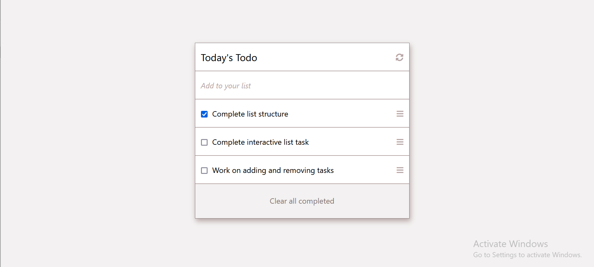

# ToDoList
This is a Todo list JavaScript project that allows users to add tasks they'd like to accomplish, and remove them once done. The project is built using webpack, and files are served using the webpack dev server.

## Built with
- HTML
- CSS
- JavaScript

## Live Demo
[Live Demo Link](https://blakbox23.github.io/ToDoList/)

## Prerequisites
 -  Node.js
 -  NPM

## Setup

Clone the repository with:

`git clone https://github.com/blakbox23/ToDoList.git`

## Install
To install dependancies run:

`npm install --save-dev webpack webpack-cli webpack-dev-server html-webpack-plugin style-loader css-loader` 

## Usage
To use the application run.

`npm run start`

👤 **Author**

- GitHub: [@Blakbox23](https://github.com/blakbox23)
- Twitter: [@blakbox23](https://twitter.com/blakbox23)
- LinkedIn: [Peter Mbuthia](https://www.linkedin.com/in/peter-mbuthia)

## 🤝 Contributing

Contributions, issues, and feature requests are welcome!

Feel free to check the [issues page](https://github.com/blakbox23/ToDoList/issues).

## Show your support

Give a ⭐️ if you like this project!

## Acknowledgments

- Hat tip to anyone whose code was used
- Microverse Inc

## 📝 License

This project is [MIT](./MIT.md) licensed.

